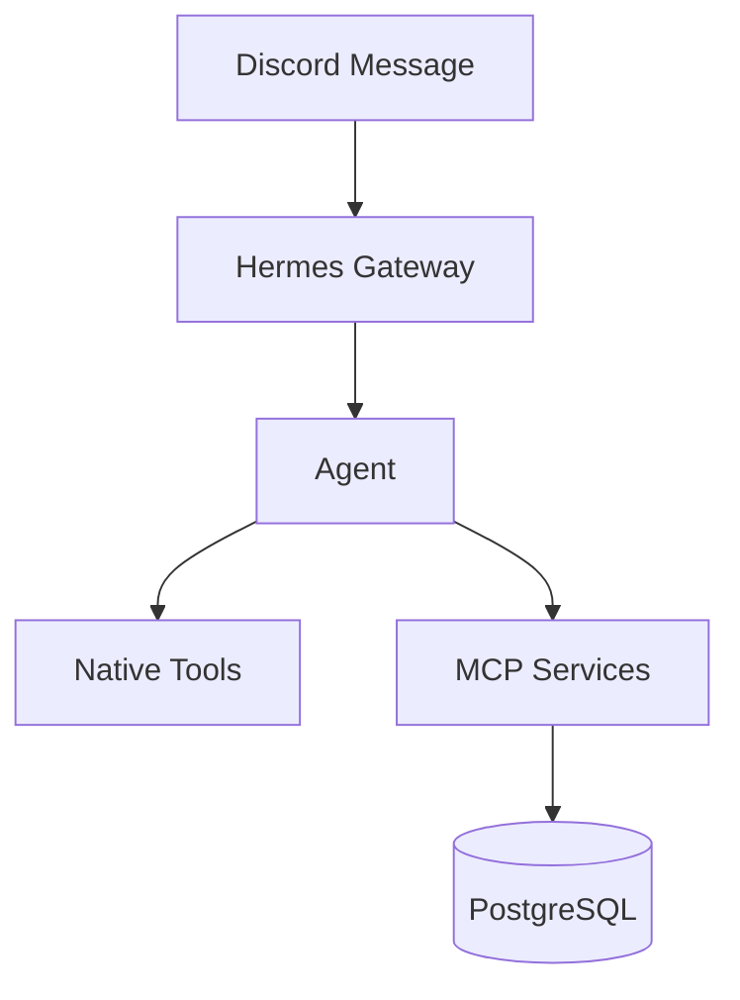

# Architecture

Nizam-OS is a private AI operating system on a single VPS. Eight autonomous agents each own a domain of life or business. They communicate through Discord, call MCP services over HTTP, and run as systemd services under a single user account. All interaction happens through Discord. The VPS is invisible.

**VPS:** Hostinger KVM2 — 8 GB RAM, 100 GB SSD, Ubuntu 24.04 LTS, 10 Jun 2027, 107.89 USD.

---

## Components

**Infrastructure layer:**

| Component | Role |
|-----------|------|
| PostgreSQL + pgvector + ParadeDB | Primary database. pgvector for semantic search; ParadeDB for BM25 full-text search. |
| Redis | LiteLLM exact-match cache. Future: semantic cache. |
| LiteLLM proxy | Routes all model calls to OpenRouter. Spend tracking, caching, token counting, rate limits. |
| Langfuse (self-hosted) | LLM observability — traces prompts, responses, latency, and cost. Enabled on-demand for debugging only; disabled in normal operation. |
| Prometheus + node-exporter | Metrics collection. Custom `.prom` textfiles for LLM spend and service health. |
| Loki + Promtail | Log aggregation. Promtail tails `nizam-os/logs/*.log` and ships to Loki. Grafana reads logs via Loki datasource. |
| Grafana | Dashboards over Prometheus, Loki, and PostgreSQL. Two dashboards: Personal and Business. |
| Tailscale | VPN for VPS management. Not used by agents. |
| fail2ban + ufw | SSH hardening. |

---

## Agent roster

Eight agents across two domains (personal and business). All run as Hermes profiles on the same VPS.

| Agent | Persona | Domain |
|-------|---------|--------|
| Nazim | System admin | Personal |
| Noor | Knowledge curator | Personal |
| Ayah | Personal assistant | Personal |
| Raha | Chief of staff (orchestrator) | Business |
| Hala | CFO | Business |
| Omar | CRO | Business |
| Reem | CTO | Business |
| Mira | CMO | Business |

> Agent channels, toolsets, MCP access, and command allowlists: [SERVICES](SERVICES.md).

---

## Load-bearing design decisions

### HTTP over stdio for MCP

Stdio MCP spawns a Python process per agent session — multiple active agents means multiple processes, each holding a DB connection and RAM. HTTP means one process, one DB connection, fixed RAM regardless of active agent count. Cold start per session drops to zero. All MCP services run as standalone systemd units and expose a single HTTP endpoint.

### LiteLLM as the single model proxy

All LLM calls route through LiteLLM → OpenRouter. Switching model providers requires only a config change — no code changes to agents or services. Spend tracking, token counting, caching, and key rotation are centralized here.

### Per-service DB roles

Each service connects as its own PostgreSQL role with grants scoped to exactly the schemas it needs. Isolation is enforced at the DB layer, not by convention. A compromise of one service cannot read another service's data.

### Approval gate on all agent actions

Every file write, terminal command, MCP call, and memory write surfaces to the owner in Discord before executing via `approvals.mode: manual`. Agents cannot take irreversible actions autonomously.

### Agents are independent of services

A service does not know or care which agent calls it. One service can serve multiple agents with different tool filters. Adding capability means building a new service — not modifying an existing agent.

### Skills: zero defaults, explicit additions

Each Hermes profile starts with all default skills disabled. Only skills required for the agent's mandate are enabled. This prevents skill surface creep and keeps each agent's capability set auditable.

### `allow_lazy_installs: false` on all profiles

The Hermes default allows agents to run `pip install` at runtime. This is disabled everywhere. Every dependency must be declared in `pyproject.toml` and reviewed. Agents cannot pull in packages silently.

---

## Knowledge vault

`~/nizam-vault/` on the VPS (git repo). Notes are Markdown with YAML frontmatter. Three subdirectories: 
- `commons/` (Noor)
- `personal/` (Ayah — journal) 
- `business/` (future)

Notes use an `areas` field (multi-value controlled vocabulary) instead of a strict single-domain taxonomy. Overlap is expected — a note on stoicism can be both `philosophy-ethics` and `personal-development`. Area vocabulary is enforced at write time by knowledge-service.

---

## Observability

Three systemd timers write `.prom` metric files for LLM spend, service health, and tool call counts. Prometheus scrapes these via node-exporter's textfile collector. Grafana dashboards visualize agent spend and service status. The Grafana PostgreSQL datasource connects as the `grafana` DB role (SELECT-only).

---

## Cross-cutting constraints

- All internal services bind to `127.0.0.1` only. Nothing is publicly reachable except SSH.
- `cron_mode: deny` on most profiles. Nazim and Raha have `cron_mode: manual`.
- `redact_secrets: true` on all profiles. Hermes scrubs known secret patterns from tool output.
- `max_spawn_depth: 2` on Reem (the only agent with delegation toolset). Sandbox agents can spawn further agents.
- No agent connects directly to any external model API. All inference routes through LiteLLM.
- **Single secrets file:** all secrets live in `secrets/nizam-os.env`. No per-service `.env` files for MCP services. Per-agent `.env` files (Discord token, LiteLLM virtual key) are the only exception — one per Hermes profile.
- **Minimal config files:** tunables for a service live in one `config.yaml` per service directory. No proliferation of per-component config files. Changing a tunable requires editing one file and restarting the service.
- **Uniform service logging:** every MCP service logs JSON to `nizam-os/logs/<service-name>.log` via systemd stdout/stderr redirect. Fixed fields: `ts`, `level`, `service`, `module`, `func`, `msg`. All services using `nizam-shared` get this automatically. Rotation handled by `config/logrotate.nizam`.

> Security model: [SECURITY](docs/SECURITY.md).
