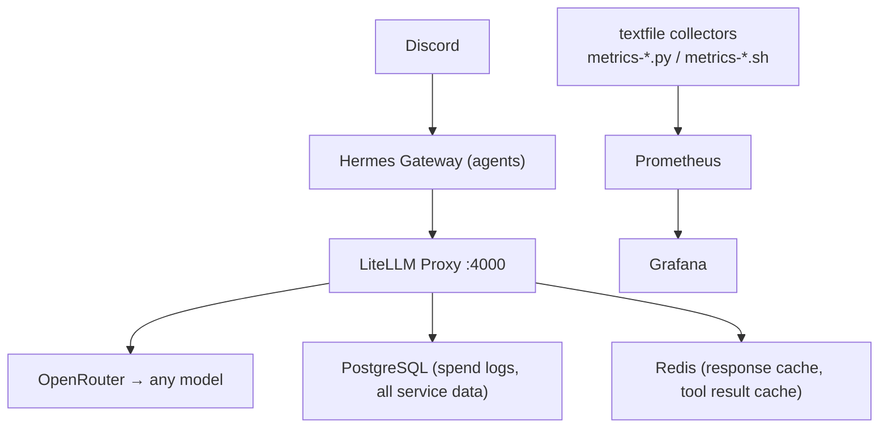

# nizam-os — Setup guide

Agentic OS on a single Hostinger VPS (Ubuntu 24.04, 8GB RAM, 100GB SSD).  
Sole interface: Discord  
Framework: Hermes Agent  
LLM routing: OpenRouter via LiteLLM

Architecture: [architecture.md](architecture.md) · Agents: [agents.md](agents.md) · Services: [services.md](services.md) · Debugging: [debugging.md](debugging.md)

---

## Stack overview

---

## Steps

| # | What | Status | Guide |
|---|---|---|---|
| 0 | Prerequisites — runtimes, infra, secrets | Done | [step-0-prerequisites.md](guide/step-0-prerequisites.md) |
| 1 | LLM observability — LiteLLM proxy + spend logs + metrics + Grafana | Done | [step-1-llm-observability.md](guide/step-1-llm-observability.md) |
| 2 | Setup agents — disable default hermes, create named profiles, wire to nizam-os | In progress | [step-2-setup-agents.md](guide/step-2-setup-agents.md) |
| 3 | DB migrations via dbmate | Planned | — |
| 4 | Ayah (personal assistant) + finance-service MCP | Planned | — |
| 5 | personal-service MCP (habits, goals, tasks) | Planned | — |
| 6 | Business agents — CoS + C-suite profiles | Planned | — |

---

## Invariants

- Every service gets its own PostgreSQL role and schema — blast radius of any compromise is one schema
- All systemd units are symlinked from the repo — `git pull` + `systemctl daemon-reload` is the deploy
- Observability ships with each step — metrics and Grafana panels added before moving on
- Model-agnostic everywhere — provider choice is config (`config/litellm.yaml`), not code
- No hardcoded pricing — OpenRouter `/api/v1/models` is the source of truth, cached 24h in Redis
