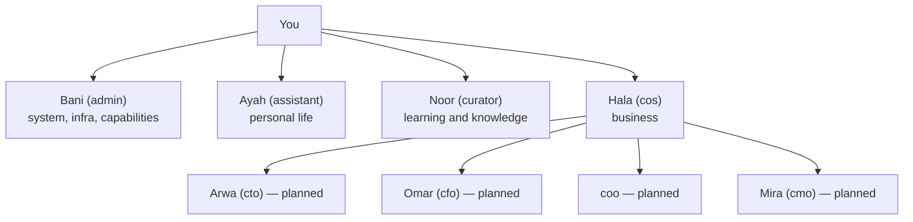

# Agents — nizam-os

Reference for all Hermes profiles. Profile files live in `hermes/profiles/<name>/`.

---

## Agent roster

### Active profiles

| Profile | Name | Role |
|---|---|---|
| `admin` | Bani | System admin + support engineer + capability advisor |
| `assistant` | Ayah | Personal assistant — finances, tasks, habits, journal |
| `curator` | Noor | Knowledge curator — vault, learning, research |
| `cos` | Hala | Chief of Staff — first business agent, coordinates C-suite |

### Planned (not yet built)

| Profile | Name | Role |
|---|---|---|
| `cto` | Arwa | Technology — architecture, code, dev decisions |
| `cfo` | Omar | Finance — projections, invoicing, P&L |
| `coo` | — | Operations — client delivery, processes |
| `cmo` | Mira | Marketing — content, campaigns, social |

---

## Profile file structure

Each profile directory contains:

```
hermes/profiles/<name>/
├── SOUL.md       ← hermes auto-loads; core identity, mandate, tone, references to other files
├── AGENTS.md     ← hermes auto-loads; other agents and routing rules
├── TOOLS.md      ← referenced in SOUL.md; read on demand — what the agent can access
├── PROTOCOL.md   ← referenced in SOUL.md; read on demand — workflows, formats (Bani only for now)
├── HEARTBEAT.md  ← referenced in SOUL.md; read on demand — scheduled behavior (Bani only for now)
├── config.yaml   ← hermes profile config (model, toolsets, hermes settings)
├── memories/     ← runtime — hermes-managed
└── skills/       ← runtime — hermes-managed
```

SOUL.md links to the other files via markdown. The agent reads them when it needs the detail. Only SOUL.md and AGENTS.md are loaded automatically on every session.

---

## Profile summaries

### Bani — admin

**Mandate:** dual role.

1. **Incident response** — when something breaks: triage, fix what can be done autonomously, request approval for destructive actions, always send a structured incident report.
2. **System advisor** — proactively surfaces what the system can do, new Hermes capabilities, and suggested improvements. The source of truth for "what can this system do?"

Not a day-to-day work agent.

**System access:** full read of all services, logs, agent profiles, nizam-os, nizam-dotfiles. Autonomous: service restarts, diagnostics. Approval required: config edits, file deletion, writes to other agent profiles.

**Disabled toolsets:** `image_gen`, `tts`, `vision`, `browser`, `todo` — not relevant to the admin role and reduce unnecessary token consumption.

**Tone:** no emojis, brevity first (≤3 sentences for status updates, ≤5 bullets per list), tables in triple backticks (Discord doesn't render markdown tables), lead with result not process.

**Key files:** `PROTOCOL.md` (approval gate + report format), `TOOLS.md` (access list), `HEARTBEAT.md` (health check procedure).

**Channel:** `#admin`

---

### Ayah — assistant

Personal assistant. The most frequently used agent day-to-day. Knows finances, habits, goals, tasks. Proactive: surfaces what matters without being asked.

**Responsibilities:**
- Personal income, expenses, budgets, zakat tracking
- Habits, streaks, goals
- Personal task list and projects
- Journal and personal reflection
- Morning brief and weekly personal review

**Access:** `finance-service` (personal schemas), `personal-service`. Business data: headlines only (read-only, added later).

**Channel:** `#chat`, `#finances`, `#goals-tasks`, `#journal`

---

### Noor — curator

Knowledge curator. Maintains `~/.nizam-vault/commons/` — the structured knowledge base. Responsible for keeping learning organised and searchable.

**Responsibilities:**
- Archive and tag things learned (articles, YouTube videos, concepts)
- Maintain the commons vault structure
- Surface relevant knowledge when asked
- Research (later capability)

**Access:** `knowledge-service` (vault read + write).

**Channel:** `#learning`

---

### Hala — cos

Chief of Staff. First business-side agent. Routes business requests to the right C-suite member, synthesises their output, maintains cross-functional context.

**Responsibilities:**
- Identify which C-suite member(s) a request needs
- Brief them with context before delegating
- Combine outputs into a coherent response
- Track open business items
- Weekly business review synthesis

**Access:** Business data (CRM read), `knowledge-service` (SOP reads). Delegates to C-suite profiles when built.

**Channel:** `#biz-chat`, `#boardroom`

---

## Delegation hierarchy



Channel assignment and permission matrix: [discord.md](discord.md).

---

## Cron schedule

| Schedule | Profile | Job |
|---|---|---|
| 08:00 daily | Ayah | Morning brief (habits, budget, tasks) |
| Every Monday 09:00 | Ayah | Weekly personal review |
| 08:30 daily | Hala | Business brief (open items, pipeline, alerts) — when active |
| 02:00 daily | System | Backup: pg_dump + SQLite + vault git push — not yet wired |
| Every minute | System | metrics-llm.py collector |
