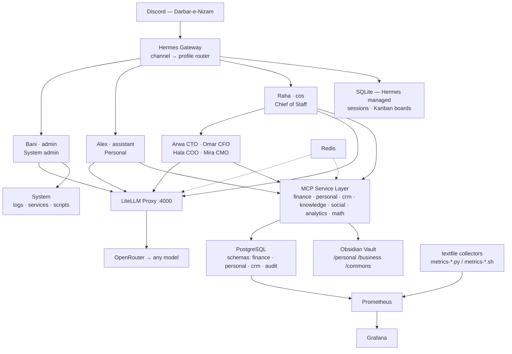

# Architecture — Nizam-OS

## System Diagram



> Excalidraw diagram attached separately — cleaner visual.

---

## Three Domains

```
PERSONAL          BUSINESS (Arc Systems)     COMMONS (Learning)
────────          ──────────────────────     ──────────────────
Alex              Raha → C-Suite             Flat vault
                                             Read on-demand only
Finances          CTO · CFO · COO · CMO      Write w/ approval
Goals · Tasks     + Bani (system admin)      No dedicated agent
Habits
Journal
```

**Cross-domain rules:**
- Personal sees business headlines only (revenue, client count, pipeline value)
- Commons: read on-demand by allowed profiles, write only by Alex with your approval
- All writes logged to `audit_log`

---

## Why MCP

All agent↔service communication uses MCP. Agents auto-discover tools at connection time — no manual prompt engineering per API. Native Hermes integration: declare a server in config, done.

---

## Model Independence

Model choice is config, not code. Every profile specifies its model. Switching from Sonnet to GPT-5 or Gemini is one line in the profile config. OpenRouter is the single provider abstraction.

**Rules:** No model-specific prompt patterns. No XML tag reliance. Tool calling via MCP (model-agnostic). System prompts in plain natural language.

---

## Infrastructure

| Component | RAM | Notes |
|---|---|---|
| Ubuntu 24.04 | ~800MB | OS |
| Hermes Agent | 600MB–1GB | systemd |
| PostgreSQL 16 | 256–512MB | pg_search + pgvector extensions |
| Grafana | 200MB | |
| Prometheus | 200–300MB | |
| Redis | ~30MB | cache + retry queue |
| Tailscale | ~30MB | zero public ports after setup |
| **Typical total** | **~3.5–5GB** | headroom for Claude Code spawns |

**Sandboxing:** Firejail (`devbox.profile`) for CTO/dev sub-agents. Separate `dev-user` Linux account. Filesystem whitelist, caps dropped, no root, seccomp filter.

**Backups:** Daily 2AM — pg_dump + SQLite copy + vault git push. Weekly full dump → Hostinger/B2. 7 daily / 4 weekly retention. Recovery ~1 hour.

---

## Per-Service DB Users

Each MCP service has its own PostgreSQL role. Compromise of one service = one schema exposed.

| Service | Role | Access |
|---|---|---|
| finance-service | svc_finance | RW on finance, insert-only on audit |
| personal-service | svc_personal | RW on personal, insert-only on audit |
| crm-service | svc_crm | RW on crm, read on finance (quoting), insert-only on audit |
| knowledge-service | svc_knowledge | RW on knowledge, insert-only on audit |
| analytics-service | svc_analytics | Read-only all schemas, RW on audit |
| litellm | svc_litellm | RW on litellm schema |

---

## Data Access Matrix

| Profile | Personal Finance | Biz Finance | CRM | Commons | Biz Headlines |
|---|---|---|---|---|---|
| Bani | — | — | — | — | — |
| Alex | **RW** | — | — | R + write w/ approval | R (aggregates) |
| Raha | — | — | — | — | R |
| Arwa (CTO) | — | R (project costs) | R (requirements) | R | — |
| Omar (CFO) | — | **RW** | R (invoicing) | — | — |
| Hala (COO) | — | R (quoting) | **RW** | — | — |
| Mira (CMO) | — | — | R (case studies) | R | — |

---

## Search & Retrieval

Phase 1 uses hybrid search from day one:

| Strategy | How | When |
|---|---|---|
| Keyword FTS | PostgreSQL `tsvector` + GIN | Exact term matches |
| BM25 | `pg_search` extension (ParadeDB) | Relevance-ranked results |
| Semantic | `pgvector` + embedding model via OpenRouter | Conceptual similarity, no shared keywords |
| Hybrid | BM25 + cosine combined via Reciprocal Rank Fusion | Default for all knowledge queries |

Embeddings recomputed only on content change (content_hash tracking). Embedding model is config in `config/litellm.yaml` — swap without code changes.

---

## Caching Strategy

**LLM responses:** LiteLLM Redis cache — identical requests returned from cache, not billed.

**MCP tool results (Redis, per-service):**

| Tool | TTL | Invalidated by |
|---|---|---|
| `budget_status()` | 15 min | Any transaction/budget write |
| `fund_status()` | 15 min | Any fund write |
| `zakat_status()` | 1 hour | Zakat or gold_holdings write |
| `business_headlines()` | 30 min | Any biz finance or CRM write |
| `habit_streak()` | Until next log | habit_log insert |
| `client_list()` | 15 min | Any CRM write |

**OpenRouter model prices:** 24h TTL in Redis, key `nizam:openrouter:model_prices`. No hardcoded pricing anywhere.

**Graceful degradation:** Redis-backed retry queue per profile. On provider failure, messages queued and processed in order on recovery. Alert posted to `#alerts`.

---

## Cost Estimate

| Item | Monthly |
|---|---|
| VPS (annualized) | ~$12 |
| Sonnet (Alex, Raha, Omar, Hala, Mira) | $20–50 |
| Opus (Arwa) | $15–40 |
| Flash (sub-agents) | $3–10 |
| **Total** | **$50–112** |

Controls: Grafana alert at $60/mo warn, $90/mo hard. CFO zero delegation. Max 4 concurrent sub-agents system-wide.

---

## Server Separation (Future)

Single VPS now. When business grows:

- **VPS 1** — Personal: Alex, personal-service, finance (personal), knowledge, commons vault
- **VPS 2** — Business: C-suite, finance (business), crm-service, social-service

Bridge: one-way read-only HTTP endpoint from VPS 2 exposing business headlines to VPS 1. No other runtime dependency between machines. Schemas are already separated so migration is clean.

---

## Risks

| Risk | Mitigation |
|---|---|
| RAM pressure | Grafana alert at 7GB. Reduce concurrent agents or upgrade VPS. |
| API cost spiral | Depth limits, CFO zero delegation, per-profile tracking |
| Single point of failure | Daily backups + dotfiles repo + Bitwarden. Recovery ~1 hour. |
| Secret compromise | sops + age encryption. Age key in Bitwarden + encrypted USB + paper. |
| Provider outage | Redis retry queue. Messages processed in order on recovery. |
| Skill drift | SAVE framework — git-tracked, approval-gated, TTL + health scoring |
| Model lock-in | OpenRouter abstraction. Switching model = one config line. |
