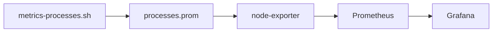

# Documentation convention

Applies to: nizam-dotfiles, nizam-os. Shared style, consistent across both.

---

## Principles

- Write for two readers at once: someone who just wants to understand, and someone who needs to act.
- Say what something is before saying how it works.
- Short over long. If a sentence can be cut without losing meaning, cut it.
- Mention the non-obvious. Skip the obvious.
- Docs should be referenceable — write with the assumption that another doc will link here.
- Don't duplicate. One doc owns a topic; others link to it. Duplicated content drifts out of sync.
- Docs change with code in the same commit. No "update docs later" — later never comes.

---

## Voice and tone

- Imperative mood for instructions: "Run this", not "You should run this".
- Active voice: "The script writes a file", not "A file is written by the script".
- Sentence case for all headers: "How it works", not "How It Works".
- Plain English. No buzzwords: no "robust", "leverage", "scalable", "cutting-edge", "seamless".
- Short synonyms: "use" not "utilize", "fix" not "implement a solution for", "run" not "execute".
- No filler openings: never start a doc with "This document describes..." or "In this section we will...".

---

## README

The README is the most important file in a repo. It is read by everyone — tech and non-tech alike. Write it so a non-technical person understands what the project is and why it matters, and a technical person understands how it works and where to go next.

Structure (in order):

```
# repo-name
One sentence. What this is. Not what it does — what it IS.

Two to three sentences. What it does, why it exists.
No jargon. No list of buzzwords.

## What it covers
- Bullet list. Plain English. One idea per line.

## Repo layout
Directory tree with one-line explanations per entry.

## Boundary (if applicable)
What belongs here and what does not.
One clear test the reader can apply themselves.

## Setup
One line. Points to the relevant doc in docs/.

---

## How it fits
Comparison table. Three repos, what each handles. Near bottom.
```

Rules:
- No emojis anywhere in any doc.
- Comparison table goes near the bottom — context after the reader understands the repo.
- Do not link to other repos. Name them.

---

## docs/

- One file per topic. If a file exceeds ~80 lines, consider splitting.
- Filename: kebab-case (`startup-guide.md`, not `StartupGuide.md`).
- Start with substance. No intro paragraph explaining what the file is about.
- Cross-reference freely using relative links: `[dashboard guide](dashboard.md)` or `[section](file.md#section)`.
- Tables over prose for structured comparisons or option lists.
- All commands in fenced code blocks with language tag.
- Walls of text are a failure. If a section is getting long, it needs a table, a list, or a split.
- Max header depth is `###`. If a section needs `####`, the file needs splitting.

**When to create a new doc:** a new file when the topic is a distinct operational area — a new service, a new procedure, a new subsystem. Otherwise extend the existing file. If unsure, extend first and split when it gets unwieldy.

## Repo structure trees

Show directory trees in a `bash` fenced block. Entries describe what a directory **contains**, not what files exist inside it. File names are not listed.

Correct:
```bash
nizam-dotfiles/
├── shell/      zsh config, prompt theme, aliases
├── scripts/    metric collectors, shared logger, install script
├── systemd/    service and timer units for metric collectors
├── config/     logrotate config
├── grafana/    dashboard JSON
├── docs/       setup and reference docs
└── logs/       runtime script output (gitignored)
```

Wrong — lists files instead of describing purpose:
```bash
nizam-dotfiles/
├── shell/      .zshrc, .p10k.zsh, aliases-zsh
├── scripts/    metrics-security.sh, git-status.sh, _log.sh, install.sh
```

---

## Lists

Use `-` for unordered lists. Use `1.` for sequential steps. Never mix within the same context.

Correct:
```
- item
- item
- item
```

Correct:
```
1. First step
2. Second step
3. Third step
```

Wrong — mixed style in same list:
```
- item
1. item
```

Nested lists: match the parent style unless the child is a different type (e.g., substeps under a bullet).

For ordered lists, write every item as `1.` — let the Markdown renderer handle numbering. Reordering steps then requires no renumbering.

```
1. First step
1. Second step
1. Third step
```

---

## Code and scripts

**Script header (docstring):**

Immediately after the shebang. Describe what the script does and any non-obvious constraint — timer cadence, side effects, dependencies. Multi-line is allowed but keep it tight. Four lines is a ceiling, not a target.

```bash
#!/usr/bin/env bash
# Collect top CPU and memory consuming processes for Grafana.
# Excludes transient collection tools (ps, awk, du) that spike briefly at 100%.
# Runs every 30 seconds via metrics-processes.timer.
```

**Python docstrings (Google style):**

One-line summary on the first line. Expand only when behavior is non-obvious — skip sections that would just repeat the type hints or the name. Same brevity rules apply: no filler, no narrating what the code does.

```python
def route_message(message: str, context: dict) -> str:
    """Route message to the appropriate agent based on context.

    Args:
        message: Raw user input.
        context: Session state including history and active agent.

    Returns:
        Agent name to handle the message.

    Raises:
        RoutingError: If no agent matches and no fallback is configured.
    """
```

Omit `Args`/`Returns`/`Raises` sections when they add nothing beyond the signature. A function named `get_user(user_id: int) -> User` does not need `Args: user_id: The user ID`.

**Inline comments:**

One line max. Only for non-obvious WHY — a hidden constraint, a workaround, a surprising invariant. Never narrate what the code does; the code does that.

```bash
# du not excluded by default — add it or metrics-disk concurrent run spikes to 100%
EXCLUDE='/\/(ps|awk|grep|sh|bash|du)$/'
```

Not:
```bash
# Set the output file path
OUT="/var/lib/prometheus/node-exporter/processes.prom"
```

---

## Callouts

Use `>` blockquotes for warnings or critical notes that must not be missed. Use sparingly — overuse makes everything look important, which means nothing is.

```markdown
> Removing the public SSH port before confirming Tailscale works will lock you out.
```

Never use blockquotes for general information or tips. If it doesn't carry real risk or consequence, write it inline.

---

## Diagrams

Use Mermaid. Never ASCII art.



Keep diagrams small — one concept per diagram. If it needs a legend to be readable, it is too complex.

---

## Tables

Use tables for structured comparisons, option lists, and service inventories. Keep cells short — one idea per cell. No prose in table cells.

| Column | Column |
|--------|--------|
| short  | short  |

---

## Cross-referencing

Write docs so they can be linked. Use lowercase, hyphenated anchors (GitHub auto-generates from headers).

Link style:
```markdown
See [dashboard guide](dashboard.md) for import steps.
See [metrics pipeline](dashboard.md#pipeline) for the data flow.
```

When referencing another repo, name it — do not link: "See nizam-os for service setup."

---

## What not to write

- "This document describes..."
- "In this section we will cover..."
- "As mentioned above..."
- "Please note that..."
- "It is worth noting that..."
- "Simply run..." (nothing is simple)
- Trailing "Next steps" sections unless they contain specific, actionable links
