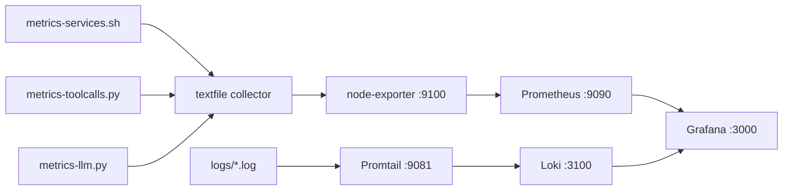

# Personal dashboard

Live LLM spend, service health, tool usage, and logs via Prometheus + Loki → Grafana. Covers the metric pipeline, dashboard panels, alert rules, and operational reference.

---

## Metric pipeline



| Script | Output file | Fires at | Reason |
|---|---|---|---|
| `metrics-llm.py` | `nizam-llm.prom` | every minute | LiteLLM DB is the source — fast poll keeps spend visible near-realtime |
| `metrics-services.sh` | `nizam-services.prom` | `:01` of every 5th minute | `systemctl is-active` polls are cheap; 5-min window is enough for alerting |
| `metrics-toolcalls.py` | `nizam-toolcalls.prom` | `:03` of every 5th minute | Same frequency as services; staggered by 2 min to avoid concurrent startup |

Timers are staggered so no two collectors fire at the same wall-clock minute. All three write Prometheus textfiles to `/var/lib/prometheus/node-exporter/`. node-exporter exposes them; Prometheus scrapes node-exporter. Service and script logs are tailed by Promtail and shipped to Loki.

---

## Dashboard import

Grafana, Prometheus, Loki, and Promtail are installed by `001-foundation.sh`. Once running:

1. Connections → Data Sources → Add → **Prometheus** — URL: `http://localhost:9090`, UID: `nizam-prometheus` → Save & Test
2. Connections → Data Sources → Add → **Loki** — URL: `http://localhost:3100`, UID: `nizam-loki` → Save & Test
3. Dashboards → New → Import → upload `grafana/personal-dashboard.json`

> Panels that depend on future-phase data (knowledge, finance, habits) show "no data" until that phase is live. That is expected and correct.

---

## Dashboard panels

Dashboard panels are iterative — visual panels evolve, get added, or get removed. The spec panel table is a reference baseline, not a locked contract.

### LLM panels (Phase 1 — live immediately)

| Panel | Type | Metric |
|---|---|---|
| LLM spend today | Stat | `nizam_llm_spend_usd_today` |
| LLM spend this month | Stat | `nizam_llm_spend_usd_this_month` |
| LLM spend all time | Stat | `sum(nizam_llm_spend_usd_total)` |
| Cache hit rate (all time) | Gauge | `nizam_llm_cache_hit_rate_alltime` |
| Requests today | Stat | `nizam_llm_requests_today` |
| Input tokens today | Stat | `nizam_llm_input_tokens_today` |
| Output tokens today | Stat | `nizam_llm_output_tokens_today` |
| Input tokens all time | Stat | `sum(nizam_llm_input_tokens_total)` |
| Output tokens all time | Stat | `sum(nizam_llm_output_tokens_total)` |
| Spend by model (personal agents) | Bar chart | `nizam_llm_spend_usd_total{profile=~"ayah\|noor\|nazim\|rashid"}` |
| Avg latency by model (1h) | Time series | `nizam_llm_avg_latency_ms_1h` |

`nizam_llm_cache_hit_rate_alltime` is a 0.0–1.0 gauge computed from all-time totals: `total_cache_reads / total_requests`. A low all-time rate means caching is not kicking in for repeated queries; check LiteLLM exact-match config.

### Tool call panels (Phase 1 — live immediately)

| Panel | Type | Metric |
|---|---|---|
| Tool calls today by tool | Bar chart | `nizam_tool_calls_today` (personal profiles) |
| Tool output size by tool (today) | Bar chart | `nizam_tool_output_chars_today` (personal profiles) |
| Tool error rate | Stat | `nizam_tool_errors_total / nizam_tool_calls_total` |

Tool output size by tool identifies which tools are returning disproportionately large payloads — useful for diagnosing context bloat and slow agent turns.

### Service health (Phase 1 — live immediately)

| Panel | Type | Metric |
|---|---|---|
| Services healthy count | Stat | `nizam_services_up_total` |
| Services up/down over time | State timeline | `nizam_service_up` |

State timeline shows gaps immediately. Services tracked: `litellm-proxy`, `loki`, `promtail`, `watcher-env`, and all metric timers.

### Logs (Phase 1 — live immediately)

| Panel | Type | Source |
|---|---|---|
| Log level counts by service | Stacked bar chart | Loki `count_over_time({job="nizam-os"} \| json [$__interval])` by `level` label — one stack per level: DEBUG (gray), INFO (green), WARNING (orange), ERROR (red), CRITICAL (dark red) |
| Live logs | Logs panel | Loki `{job="nizam-os"}` |

Live logs are pretty-printed JSON. Filter by `service` label to isolate an MCP service; filter by `script` label to isolate a bash script. Both labels are extracted by Promtail — only the applicable label is set per log line.

### Agent usage panels (Phase 2 — live once Nazim is active)

Install calendar panel plugin first (required for cost heatmap):

```bash
grafana-cli plugins install marcusolsson-calendar-panel
systemctl restart grafana-server
```

**Row A — Summary stats (full-width strip)**

| Panel | Type | Query |
|---|---|---|
| Total spend all time | Stat | `sum(nizam_llm_spend_usd_total)` |
| Total input tokens all time | Stat | `sum(nizam_llm_input_tokens_total)` |
| Total output tokens all time | Stat | `sum(nizam_llm_output_tokens_total)` |
| Total tool calls all time | Stat | `sum(nizam_tool_calls_total)` |

**Row B — Spend by agent**

| Panel | Type | Query |
|---|---|---|
| Spend by agent (all time) | Bar gauge | `sum by (profile) (nizam_llm_spend_usd_total)` — legend: `{{profile}}` |
| Spend by agent (last 30d) | Bar gauge | `sum by (profile) (increase(nizam_llm_spend_usd_total[30d]))` — legend: `{{profile}}` |

Both: categorical, `bargauge` vertical. `_this_month` metrics have no profile labels — use `increase([30d])` for per-agent breakdown.

**Row C — Token usage by agent**

| Panel | Type | Query |
|---|---|---|
| Input tokens by agent (all time) | Bar gauge | `sum by (profile) (nizam_llm_input_tokens_total)` — legend: `{{profile}}` |
| Input tokens by agent (last 30d) | Bar gauge | `sum by (profile) (increase(nizam_llm_input_tokens_total[30d]))` — legend: `{{profile}}` |
| Output tokens by agent (all time) | Bar gauge | `sum by (profile) (nizam_llm_output_tokens_total)` — legend: `{{profile}}` |
| Output tokens by agent (last 30d) | Bar gauge | `sum by (profile) (increase(nizam_llm_output_tokens_total[30d]))` — legend: `{{profile}}` |

**Row D — Daily cost heatmap**

GitHub activity chart style — each cell = one day, intensity = daily spend. Red shades instead of green.

| Field | Value |
|---|---|
| Panel type | Calendar panel (`marcusolsson-calendar-panel`) |
| Query | `increase(nizam_llm_spend_usd_total[$__interval])` |
| Color scheme | Custom gradient: `#fff5f5` → `#fc8c8c` → `#e53e3e` → `#7b0000` |
| Zero-spend days | Near-white (blank appearance) |
| X axis | Calendar days |
| Cell value | Daily spend (USD) |

**Row E — Tool usage**

| Panel | Type | Query |
|---|---|---|
| Total tool calls all time | Stat | `sum(nizam_tool_calls_total)` |
| Total tool calls this month | Stat | `sum(increase(nizam_tool_calls_total[30d]))` |
| Tool calls by tool (all time) | Bar chart | `nizam_tool_calls_total` — legend: `{{tool}}` |
| Tool calls by tool (this month) | Bar chart | `increase(nizam_tool_calls_total[30d])` — legend: `{{tool}}` |
| Tools used per agent | Table | `nizam_tool_calls_total` — columns: Tool (`{{tool}}`), Agent (`{{profile}}`), Calls |
| Tool error rate | Gauge | `sum(nizam_tool_errors_total) / sum(nizam_tool_calls_total)` — unit: %, threshold: warn >5%, crit >15% |

After adding all rows: save dashboard → Share → Export → save file → overwrite `grafana/personal-dashboard.json`.

---

### Knowledge panels (Noor — Phase 4)

Vault size, ingestion rate, learning heatmap, and knowledge treemap. All sourced from PostgreSQL `knowledge` schema. Show "no data" until Phase 4.

### Finance panels (Ayah — Phase 5)

| Panel | Type | Source |
|---|---|---|
| Total balance across all accounts | Stat | PostgreSQL `finance_personal` (sum) |
| Account balances | Stat per account | PostgreSQL `finance_personal` |
| Net worth over time | Time series | PostgreSQL `finance_personal` |
| Monthly income vs expenses | Bar chart | PostgreSQL `finance_personal` |
| Expense by category | Bar chart | PostgreSQL `finance_personal` |
| Expense breakdown (L1 category / L2 subcategory) | Sunburst | PostgreSQL `finance_personal` |
| Budget utilization | Gauge per category | PostgreSQL `finance_personal` |
| Savings fund progress | Gauge per fund | PostgreSQL `finance_personal` |
| Cash flow (rolling 30d) | Time series | PostgreSQL `finance_personal` |
| Upcoming amortization payments | Table | PostgreSQL `finance_personal` |
| Zakat due estimate | Stat | PostgreSQL `finance_personal` (computed) |

Total balance is the sum across all accounts — a single figure for current liquid position. The expense sunburst shows L1 categories as the outer ring and L2 subcategories as the inner ring; hover to drill into category composition.

### Habits / goals panels (Ayah — Phase 5)

Habit completion rate, active streaks, task completion rate, and journal heatmap. All sourced from PostgreSQL `personal` schema. Show "no data" until Phase 5.

---

## Datasources

| Datasource | URL | UID |
|---|---|---|
| Prometheus | `http://localhost:9090` | `nizam-prometheus` |
| Loki | `http://localhost:3100` | `nizam-loki` |

---

## Alerts

Unified alerting via Grafana → Discord. Two severity levels, two contact points. Webhooks are active from Phase 2 — alert rules can be created in Phase 1 but will not fire until the contact points are wired up.

### Contact points

| Name | Env var | Routes |
|---|---|---|
| `nizam-warn` | `DISCORD_WEBHOOK_WARNING` | `severity=warning` |
| `nizam-crit` | `DISCORD_WEBHOOK_CRITICAL` | `severity=critical` |

Webhooks are read from `secrets/nizam-os.env` at run time.

### Setup via script (recommended)

```bash
# Fill DISCORD_WEBHOOK_WARNING and DISCORD_WEBHOOK_CRITICAL in secrets/nizam-os.env, then:
bash ~/nizam-os/scripts/setup/setup-alerts.sh
```

The script is idempotent — safe to re-run. It deletes and recreates all rules in `nizam-os` group on each run.

### Setup via Grafana UI

**1. Contact points**

Alerting → Contact points → + Add contact point

| Field | `nizam-warn` | `nizam-crit` |
|---|---|---|
| Name | `nizam-warn` | `nizam-crit` |
| Integration | Discord | Discord |
| Webhook URL | `DISCORD_WEBHOOK_WARNING` value | `DISCORD_WEBHOOK_CRITICAL` value |

Save each. Test with the Test button.

**2. Notification policy**

Alerting → Notification policies → Edit root policy → Default receiver: `nizam-crit`

Add two nested policies under root:

| Matcher | Receiver | Group wait | Repeat interval |
|---|---|---|---|
| `severity = warning` | `nizam-warn` | 30s | 4h |
| `severity = critical` | `nizam-crit` | 10s | 1h |

**3. Alert folder**

Dashboards → New → New folder → name: `nizam-alerts`

> If `nizam-alerts` already exists from nizam-dotfiles setup, use the same folder — both alert groups (`nizam-system` and `nizam-os`) can coexist inside it.

**4. Alert rules**

Alerting → Alert rules → + New alert rule. For each rule, set folder `nizam-alerts`, group `nizam-os`, add label `severity=<value>`, set **For** duration, then define two query nodes:

- **A** — datasource `nizam-prometheus`, expression as shown, instant query
- **B** — datasource `-- Expression --`, type `Classic conditions`, input A, evaluator as shown

| Rule | Expression (A) | Evaluator (B) | Severity | For |
|---|---|---|---|---|
| Service Down | `min(nizam_service_up)` | IS EQUAL TO 0 | critical | 2m |
| LLM Spend Daily Warning | `nizam_llm_spend_usd_today` | IS ABOVE 1.00 | warning | 5m |
| LLM Spend Daily Critical | same as above | IS ABOVE 3.00 | critical | 5m |
| Tool Error Rate High | `nizam_tool_errors_total / nizam_tool_calls_total` | IS ABOVE 0.10 | warning | 5m |

### Routing

| Severity | Group wait | Repeat interval |
|---|---|---|
| warning | 30s | 4h |
| critical | 10s | 1h |

Critical fires immediately and repeats hourly until resolved. Warning batches within the group window.

### Alert rules summary

All rules live in folder `nizam-alerts`, group `nizam-os`. Each threshold is a separate rule with a `severity` label — routing is driven entirely by that label.

| Rule | Warning | Critical | For |
|---|---|---|---|
| Service Down | — | any nizam service inactive | 2m |
| LLM Daily Spend | >$1.00 | >$3.00 | 5m |
| Tool Error Rate | >10% | — | 5m |

### Managing alerts

**View rules:** Grafana → Alerting → Alert rules → folder `nizam-alerts`

**Silence an alert:** Grafana → Alerting → Silences → Add silence — set label matcher and duration

**Test a contact point:** Grafana → Alerting → Contact points → `nizam-warn` or `nizam-crit` → Test

**Update a threshold:** edit `scripts/setup/setup-alerts.sh`, re-run the script

---

## Operational reference

### Check collector status

```bash
systemctl status metrics-llm.timer metrics-services.timer metrics-toolcalls.timer --no-pager
```

Trigger manually and inspect output:

```bash
systemctl start metrics-llm.service && cat /var/lib/prometheus/node-exporter/nizam-llm.prom
systemctl start metrics-services.service && cat /var/lib/prometheus/node-exporter/nizam-services.prom
systemctl start metrics-toolcalls.service && cat /var/lib/prometheus/node-exporter/nizam-toolcalls.prom
```

Confirm Prometheus is scraping:

```bash
curl -s http://localhost:9100/metrics | grep nizam_
```

Recent collector logs:

```bash
journalctl -u metrics-llm.service -n 10 --no-pager
journalctl -u metrics-services.service -n 10 --no-pager
journalctl -u metrics-toolcalls.service -n 10 --no-pager
```

### Script logs

All bash scripts write structured JSON to `~/nizam-os/logs/scripts.log`. Python services write to their own `logs/<service-name>.log`.

Bash format: `{"ts":"...","level":"INFO","script":"script-name","msg":"..."}`  
Service format: `{"ts":"...","level":"INFO","service":"service-name","module":"...","func":"...","msg":"..."}`

```bash
tail -f ~/nizam-os/logs/scripts.log
grep '"level":"ERROR"' ~/nizam-os/logs/scripts.log
```

Rotated daily, 14 days retained. Config: `config/logrotate.nizam-os`.

### Symlinks

```bash
ls -la \
  /etc/systemd/system/metrics-llm.service \
  /etc/systemd/system/metrics-llm.timer \
  /etc/systemd/system/metrics-services.service \
  /etc/systemd/system/metrics-services.timer \
  /etc/systemd/system/metrics-toolcalls.service \
  /etc/systemd/system/metrics-toolcalls.timer \
  /etc/systemd/system/watcher-env.service \
  /etc/systemd/system/watcher-inventory.service \
  /etc/systemd/system/watcher-inventory.timer
```

All entries must point to `/home/vazir/nizam-os/systemd/...`. Re-run `sudo bash scripts/setup/install-symlinks.sh` if any symlink is missing or stale.

### Common fixes

| Symptom | Fix |
|---|---|
| `.prom` file not updating | `systemctl start metrics-<name>.service && journalctl -u metrics-<name>.service -n 5 --no-pager` |
| Grafana panel shows no data | Check datasource UID matches `nizam-prometheus` or `nizam-loki` |
| `nizam_llm_*` metrics absent | Confirm `svc_litellm` role has SELECT on `litellm` schema — check `metrics-llm.py` logs |
| Symlinks missing after git pull | `sudo bash scripts/setup/install-symlinks.sh` |
| logrotate errors | `sudo logrotate -d /etc/logrotate.d/nizam-os` — confirm owner is root |
| Prometheus not showing nizam metrics | `curl -s http://localhost:9100/metrics \| grep nizam_` |
