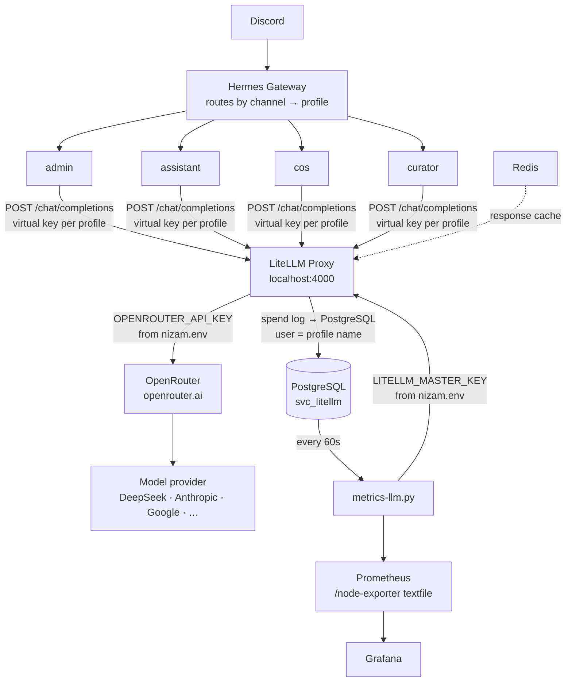

# LLM Routing — Hermes → LiteLLM → OpenRouter

## Flow



---

## Why this chain

**Hermes → LiteLLM** (not Hermes → OpenRouter directly):
- Spend tracking per profile per model in PostgreSQL
- Redis caching — identical requests returned without billing
- Single place to swap providers, set limits, or block models
- Grafana observability for all LLM usage

**LiteLLM → OpenRouter** (not LiteLLM → providers directly):
- One API key to manage (not one per provider)
- Access to 300+ models without config changes
- Automatic failover across providers

---

## Provider config (per-profile config.yaml)

```yaml
model:
  default: deepseek/deepseek-v4-flash
  provider: custom:litellm        # tells Hermes to use a named custom provider
  base_url: http://localhost:4000
  api_mode: chat/completions

custom_providers:
  - name: litellm
    base_url: http://localhost:4000
    key_env: LITELLM_MASTER_KEY   # reads from profile .env
    api_mode: chat/completions
```

`provider: openrouter` is NOT used — it hardcodes `https://openrouter.ai/api/v1` and ignores `base_url`. Use `custom:litellm` only.

---

## Keys

| Key | Location | Purpose |
|---|---|---|
| `OPENROUTER_API_KEY` | `secrets/nizam.env` + each profile `.env` | Profile → OpenRouter (direct, legacy, keep for skills that call OR directly) |
| `LITELLM_MASTER_KEY` | `secrets/nizam.env` | Admin access to LiteLLM API (`/spend/logs`, key management) |
| `LITELLM_MASTER_KEY` | Each profile `.env` | Profile's virtual key (not the master key — same var name, different value) |

Each profile `.env` has a **virtual key** in `LITELLM_MASTER_KEY`. These are generated by `scripts/setup/setup-litellm-keys.sh`. The virtual key has `user_id = profile_name`, which is how spend logs know which profile made each request.

Do not put the real master key in profile `.env` files — attribution breaks (all requests show as `default_user_id`).

---

## Spend tracking

LiteLLM records every request in PostgreSQL (`svc_litellm` schema). Available at `GET /spend/logs`.

`scripts/metrics-llm.py` (runs every 60s via systemd timer) reads `/spend/logs` and writes `/var/lib/prometheus/node-exporter/nizam-llm.prom`.

**Spend computation:** LiteLLM's built-in spend field is 0 for models not in its pricing database (e.g. new DeepSeek models). The metrics script falls back to computing spend from `prompt_tokens × prompt_price + completion_tokens × completion_price` using OpenRouter's model pricing API (cached in Redis, 24h TTL, key `nizam:openrouter:model_prices`).

**Model label normalisation:** LiteLLM logs models with `openrouter/` prefix (e.g. `openrouter/deepseek/deepseek-v4-flash`). Some models get double-prefixed (`openrouter/openrouter/anthropic/...`). The metrics script strips all leading `openrouter/` prefixes before writing labels.

---

## Setup / re-setup

After a LiteLLM DB reset or adding a new profile:

```bash
# 1. Create virtual keys for all profiles, update config.yaml if needed
bash scripts/setup/setup-litellm-keys.sh

# 2. Restart all gateways
systemctl --user restart hermes-gateway-admin hermes-gateway-assistant hermes-gateway-cos hermes-gateway-curator

# 3. Run metrics once to confirm
sudo systemctl restart metrics-llm.service
sudo journalctl -u metrics-llm.service -n 5 --no-pager
# should see: "wrote N series, today: X req / ... / $X.XXXX"
```

---

## LiteLLM config

`config/litellm.yaml` — wildcard passthrough to OpenRouter:

```yaml
model_list:
  - model_name: "*"
    litellm_params:
      model: "openrouter/*"
      api_key: os.environ/OPENROUTER_API_KEY
      api_base: https://openrouter.ai/api/v1
```

Any model name Hermes sends (e.g. `deepseek/deepseek-v4-flash`) gets prefixed with `openrouter/` and forwarded. No per-model config needed for new models.

---

## Grafana dashboards

Panels use these Prometheus metrics (written by `metrics-llm.py`):

| Metric | Type | Labels |
|---|---|---|
| `nizam_llm_requests_total` | counter | model, provider, profile |
| `nizam_llm_spend_usd_total` | counter | model, provider, profile |
| `nizam_llm_input_tokens_total` | counter | model, provider, profile |
| `nizam_llm_output_tokens_total` | counter | model, provider, profile |
| `nizam_llm_spend_usd_today` | gauge | — |
| `nizam_llm_spend_usd_this_month` | gauge | — |
| `nizam_llm_cache_hit_rate_today` | gauge | — |
| `nizam_llm_avg_latency_ms_1h` | gauge | model |

`profile` label = the Hermes profile name (admin / assistant / cos / curator). Enables "spend by agent" breakdown.
