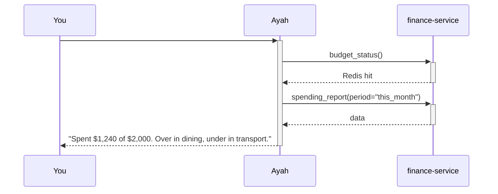
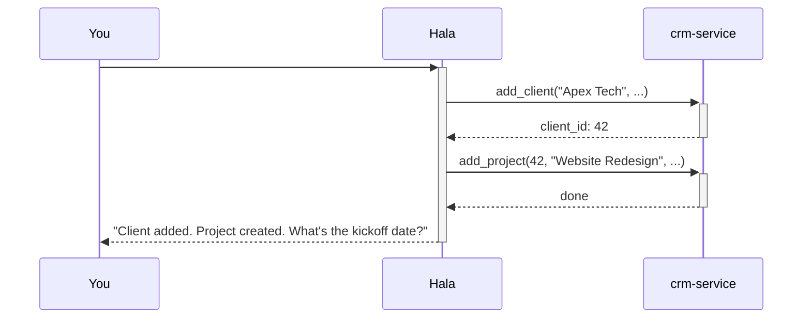
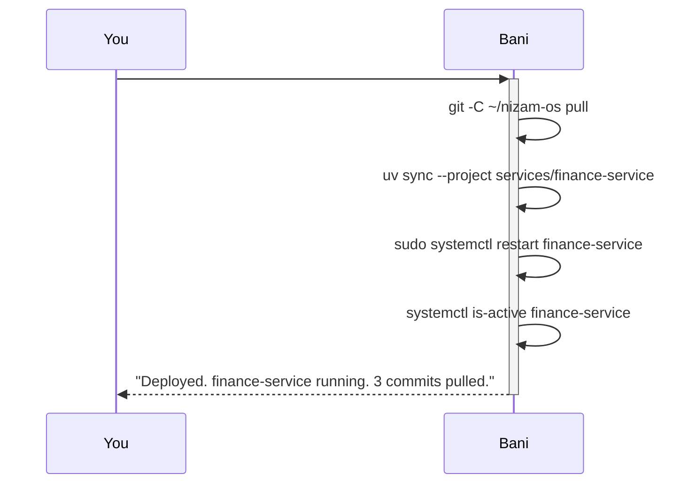

# Services — nizam-os

> Steps 0–2 are complete. Everything from step 4 onward (finance-service, personal-service, crm-service, etc.) is a design spec — the schemas and tools describe the planned implementation, not existing code.

Reference for all MCP services. Each service is a `uv` workspace member under `services/`. Full schemas in `migrations/`. Tool implementations in `services/<name>/`.

## Domain taxonomy

Everything tracked falls into one of three types:

| Type | What | Examples |
|---|---|---|
| **Goals** | Outcomes with a deadline | "Save $10k emergency fund by Q3", "Ship CRM v1 by July" |
| **Tasks** | Discrete, completable actions | "Email client re invoice", "Review architecture doc" |
| **Habits** | Recurring behaviours to track | Daily Quran, 10k steps, no spending impulse |

Goals link to tasks. Habits are independent. All three live in `personal` schema, managed by `personal-service`.

## Services overview

| Service | Schema | Primary consumer(s) | Status |
|---|---|---|---|
| `finance-service` | `finance` | Ayah (personal), Omar (business) | Step 4 |
| `personal-service` | `personal` | Ayah | Step 5 |
| `crm-service` | `crm` | Hala, Mira | Step 6 |
| `knowledge-service` | `knowledge` + vault files | Arwa, Mira, Ayah | Step 6 |
| `social-service` | external APIs | Mira | Step 7 |
| `analytics-service` | all schemas (read-only) | Hala, Bani | Step 7 |
| `math-service` | stateless | any profile | Step 7 |

Each service has its own PostgreSQL role — see [architecture](architecture.md#per-service-db-users) for the access matrix.

## Service reference

- [finance-service](services/finance.md) — personal and business finance (Ayah, Omar)
- [personal-service](services/personal.md) — goals, tasks, habits, notes (Ayah)
- [crm-service](services/crm.md) — clients, projects, pipeline (Hala, Mira)
- [knowledge-service](services/knowledge.md) — hybrid search over nizam-vault (Arwa, Mira, Ayah)
- [social, analytics, math](services/other.md) — supporting services (step 7)

Grafana panels added per step: [dashboard guide](dashboard.md).

## Flow examples

### "What's my budget looking like this month?"

### "Onboard new client Apex Tech"

### "Bani, deploy the finance-service changes"

