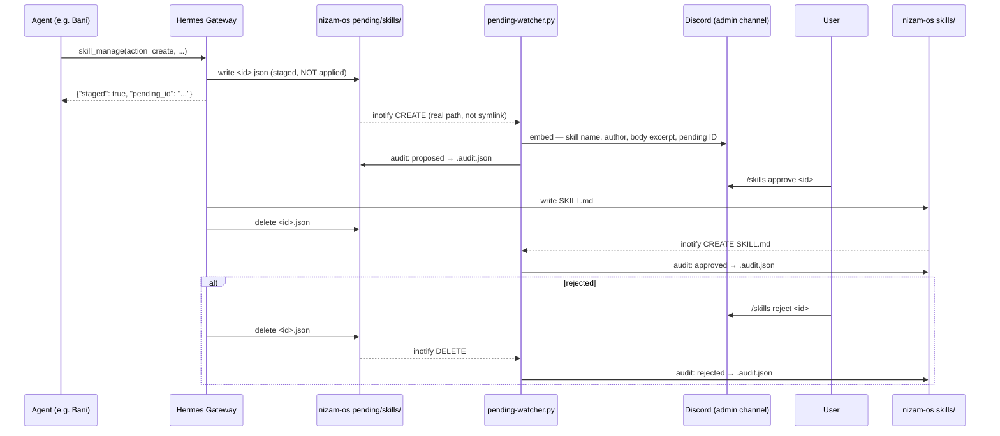

# Skill Governance — SAVE Framework

## Why

Agents (e.g. Bani) can write skills. A poisoned skill — malicious instructions embedded in SKILL.md — degrades the system silently every time it's invoked. SAVE prevents this:

| Letter | What | Mechanism |
|---|---|---|
| **S** — Snapshot | Skills + proposals are git-tracked | `pending/` and `skills/` both live in nizam-os repo |
| **A** — Audit | Append-only event log | `skills/.audit.json` per profile, written automatically by pending-watcher |
| **V** — Validate | Gate + security scan | Hermes `write_approval: true` + `guard_agent_created: true` |
| **E** — Expire | Health scoring | `scripts/save/health-score.py` flags stale/decayed skills |

---

## Approval Flow



---

## Directory Layout

```
nizam-os/hermes/profiles/{profile}/
├── config.yaml          ← skills: write_approval + guard_agent_created = true
├── skills/
│   ├── .audit.json      ← auto-written: proposed / approved / rejected events
│   ├── .usage.json      ← written by Hermes: use count, state, last_used
│   └── {category}/{skill}/SKILL.md
└── pending/             ← real dir in nizam-os (git-tracked), symlinked from ~/.hermes
    └── skills/
        └── {id}.json    ← staged skill awaiting approval
```

`~/.hermes/profiles/{profile}/pending` → `nizam-os/.../pending` (symlink)
`~/.hermes/profiles/{profile}/skills` → `nizam-os/.../skills` (symlink)

Pending proposals are in the repo while they wait — git-trackable evidence of every proposal.

---

## Config (per profile)

`hermes/profiles/{profile}/config.yaml`, under `skills:`:

```yaml
skills:
  guard_agent_created: true   # Hermes security-scans agent-authored skills before staging
  write_approval: true        # All skill writes staged to pending queue, not applied immediately
```

Both flags must be `true`. `write_approval: false` lets skills land immediately — no gate.

Do not confuse with `memory.write_approval` (different section, stays `false`).

---

## Audit Log

`hermes/profiles/{profile}/skills/.audit.json` — append-only JSON array.

**Written automatically** by `pending-watcher.py`. No manual edits needed.

```json
[
  {
    "event": "proposed",
    "skill": "server-healthcheck",
    "actor": "admin",
    "timestamp": "2026-06-27T10:17:13Z",
    "note": "action=create pending_id=8d3a622c"
  },
  {
    "event": "approved",
    "skill": "server-healthcheck",
    "actor": "user",
    "timestamp": "2026-06-27T10:22:00Z",
    "note": "SKILL.md appeared in skills dir after pending gate"
  }
]
```

Events written automatically:
| Event | Trigger |
|---|---|
| `proposed` | Pending JSON appears in `pending/skills/` |
| `approved` | SKILL.md appears in `skills/` matching a tracked proposal |
| `rejected` | Pending JSON deleted without a corresponding SKILL.md appearing |

`archived` and `patched` events are not auto-written — log manually if needed.

---

## Pending Watcher

`scripts/save/pending-watcher.py` — persistent daemon via `systemd/user/hermes-skill-watcher.service`.

- Watches `nizam-os/hermes/profiles/` recursively (real path — inotify does not follow symlinks, so watching `~/.hermes/profiles/` would miss events in symlinked subdirs)
- Tracks in-flight proposals in `~/.hermes/pending/.skill_pending_map` (survives restarts)
- Startup scan catches any pending files that arrived while the daemon was down

```bash
# Check status
systemctl --user status hermes-skill-watcher.service
journalctl --user -u hermes-skill-watcher.service -n 20 --no-pager
```

### Discord embed fields
Each approval notification shows: skill name · author · action · version · description · category · tags · body excerpt · pending ID.

Footer: `/skills pending  ·  /skills approve <id>  ·  /skills reject <id>`

---

## Health Scoring

```bash
python3 scripts/save/health-score.py              # table only
python3 scripts/save/health-score.py --write      # write state flags to .usage.json
python3 scripts/save/health-score.py --profile admin
```

Score (0–100):
| Factor | Pts | Criteria |
|---|---|---|
| Recency | 40 | last_used within 7d→40, 30d→20, 60d→5, never→0 |
| Volume | 30 | use_count ≥10→30, ≥5→20, ≥1→10, 0→0 |
| Churn | 30 | patch_count/use_count <0.5→30, <1→15, ≥1→0 |

Flags (written to `.usage.json` with `--write`):
| Flag | Condition |
|---|---|
| `needs_review` | score < 30 AND use_count ≥ 3 |
| `archive_candidate` | score < 10 |
| `stale` | no use in 90d, or never used + created > 30d ago |

Flagging does NOT auto-delete. You decide what to archive.

---

## Skill Validation

```bash
python3 scripts/save/validate-skill.py path/to/SKILL.md
```

Checks: required frontmatter (`name`, `description`, `version`, `author`), name format (lowercase/hyphens/≤64 chars), description ≤200 chars, `metadata.hermes.tags` non-empty, file ≤100k chars.

Exit 0 = valid. Exit 1 = errors to stderr.

---

## Setup — New Installation

```bash
# 1. Add webhook to secrets/nizam.env
DISCORD_ADMIN_WEBHOOK=https://discord.com/api/webhooks/...

# 2. Apply governance to all profiles
python3 scripts/save/setup-profile-governance.py --all

# 3. Install and start the watcher
ln -sf /home/vazir/nizam-os/systemd/user/hermes-skill-watcher.service ~/.config/systemd/user/
systemctl --user daemon-reload
systemctl --user enable --now hermes-skill-watcher.service
```

`setup-profile-governance.py` is idempotent — safe to re-run. Skips steps already done.

---

## New Profiles — Automatic

When Hermes creates a new profile, `watch-hermes-profiles.sh` detects the new `config.yaml` and automatically calls `setup-profile-governance.py <profile>`. No manual action needed.

To apply manually to a single profile:

```bash
python3 scripts/save/setup-profile-governance.py <profile>
```

This patches config.yaml, creates `.audit.json`, wires the `pending/` symlink, and restarts the gateway.

---

## `.usage.json` vs `.audit.json`

| File | Owner | Purpose |
|---|---|---|
| `.usage.json` | Hermes | Runtime telemetry: use count, last used, state, pin. Updated on every skill invocation. Used by curator for archival decisions. |
| `.audit.json` | nizam-os (pending-watcher) | Governance trail: who proposed what, when, and what decision was made. Written on gate events only. |
